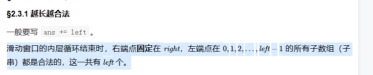

# 🚴 不定长滑动窗口

### 练习

#### 1.[无重复字符的最长子串](https://leetcode.cn/problems/longest-substring-without-repeating-characters/)

> 给定一个字符串 `s` ，请你找出其中不含有重复字符的 **最长 子串** 的长度。

```javascript
/**
 * @param {string} s
 * @return {number}
 */
var lengthOfLongestSubstring = function (s) {
    let res = 0
    const map = new Map()
    let left = 0
    for (let i = 0; i < s.length; i++) {
        if (map.get(s[i])) {
            while (s[left] !== s[i]) {
                map.set(s[left], map.get(s[left]) - 1)
                left++
            }
            map.set(s[left], map.get(s[left]) - 1)
            left++
        }
        map.set(s[i], (map.get(s[i]) || 0) + 1)
        res = Math.max(res, i - left + 1)
    }
    return res
};
```

#### 2.[每个字符最多出现两次的最长子字符串](https://leetcode.cn/problems/maximum-length-substring-with-two-occurrences/)

> 给你一个字符串 `s` ，请找出满足每个字符最多出现两次的最长子字符串，并返回该子字符串的 **最大** 长度。

```javascript
/**
 * @param {string} s
 * @return {number}
 */
var lengthOfLongestSubstring = function (s) {
    let res = 0
    const map = new Map()
    let left = 0
    for (let i = 0; i < s.length; i++) {
        if (map.get(s[i])) {
            while (s[left] !== s[i]) {
                map.set(s[left], map.get(s[left]) - 1)
                left++
            }
            map.set(s[left], map.get(s[left]) - 1)
            left++
        }
        map.set(s[i], (map.get(s[i]) || 0) + 1)
        res = Math.max(res, i - left + 1)
    }
    return res
};
```

#### 3.[删掉一个元素以后全为 1 的最长子数组](https://leetcode.cn/problems/longest-subarray-of-1s-after-deleting-one-element/)

> 给你一个二进制数组 `nums` ，你需要从中删掉一个元素。
>
> 请你在删掉元素的结果数组中，返回最长的且只包含 1 的非空子数组的长度。
>
> 如果不存在这样的子数组，请返回 0 。

```javascript
/**
 * @param {number[]} nums
 * @return {number}
 */
var longestSubarray = function (nums) {
    let right = 0
    let left = 0
    let res = 0
    let freq = 0
    while (right < nums.length) {
        if (nums[right] === 0) {
            freq++
        }
        while (freq > 1) {
            if (nums[left] === 0) {
                freq--
            }
            left++
        }
        res = Math.max(right - left, res)
        right++
    }
    return res
};
```

#### 4.[尽可能使字符串相等](https://leetcode.cn/problems/get-equal-substrings-within-budget/)

> 给你两个长度相同的字符串，`s` 和 `t`。
>
> 将 `s` 中的第 `i` 个字符变到 `t` 中的第 `i` 个字符需要 `|s[i] - t[i]|` 的开销（开销可能为 0），也就是两个字符的 ASCII 码值的差的绝对值。
>
> 用于变更字符串的最大预算是 `maxCost`。在转化字符串时，总开销应当小于等于该预算，这也意味着字符串的转化可能是不完全的。
>
> 如果你可以将 `s` 的子字符串转化为它在 `t` 中对应的子字符串，则返回可以转化的最大长度。
>
> 如果 `s` 中没有子字符串可以转化成 `t` 中对应的子字符串，则返回 `0`。

```javascript
/**
 * @param {string} s
 * @param {string} t
 * @param {number} maxCost
 * @return {number}
 */
var equalSubstring = function (s, t, maxCost) {
    let left = 0
    let right = 0
    let res = 0
    let cur = 0
    const arr = new Array(s.length).fill(0)
    for (let i = 0; i < s.length; i++) {
        const abs = Math.abs(s[i].charCodeAt() - t[i].charCodeAt())
        arr[i] = abs
    }
    console.log(arr)
    while (right < arr.length) {
        cur += arr[right]
        while (cur > maxCost) {
            cur -= arr[left]
            left++
        }
        res = Math.max(res, right - left + 1)
        right++
    }
    return res
};
```

#### 5.[找到最长的半重复子字符串](https://leetcode.cn/problems/find-the-longest-semi-repetitive-substring/)

> 给你一个下标从 **0** 开始的字符串 `s` ，这个字符串只包含 `0` 到 `9` 的数字字符。
>
> 如果一个字符串 `t` 中至多有一对相邻字符是相等的，那么称这个字符串 `t` 是 **半重复的** 。例如，`"0010"` 、`"002020"` 、`"0123"` 、`"2002"` 和 `"54944"` 是半重复字符串，而 `"00101022"` （相邻的相同数字对是 00 和 22）和 `"1101234883"` （相邻的相同数字对是 11 和 88）不是半重复字符串。
>
> 请你返回 `s` 中最长 **半重复**&#x20;
>
> 子字符串 的长度。

```javascript
/**
 * @param {string} s
 * @return {number}
 */
var longestSemiRepetitiveSubstring = function (s) {
    if (s.length === 1) {
        return 1
    }
    let left = 0, res = 0, count = 0, prevIndex = 0
    for (let right = 1; right < s.length; right++) {
        if (s[right] === s[right - 1]) {
            count++
            if (count > 1) {
                left = prevIndex
                count--
            }
            prevIndex = right
        }
        res = Math.max(res, right - left + 1)
    }
    return res
};
```

#### 6.[长度最小的子数组](https://leetcode.cn/problems/minimum-size-subarray-sum/)

> 给定一个含有 `n` 个正整数的数组和一个正整数 `target` **。**
>
> 找出该数组中满足其总和大于等于 `target` 的长度最小的&#x20;
>
> **子数组** `[numsl, numsl+1, ..., numsr-1, numsr]` ，并返回其长&#x5EA6;**。**&#x5982;果不存在符合条件的子数组，返回 `0`&#x20;

```javascript
/**
 * @param {number} target
 * @param {number[]} nums
 * @return {number}
 */
var minSubArrayLen = function (target, nums) {
    let right = 0
    let left = 0
    let sum = 0
    let res = 9999999
    while (right < nums.length) {
        sum += nums[right]
        if (sum >= target) {
            if (right === left) {
                res = 1
                break
            }
            while (sum >= target) {
                res = Math.min(res, right - left + 1)
                console.log(sum, left, right)
                sum -= nums[left]
                left++
            }

        }
        right++
    }
    return res === 9999999 ? 0 : res

};
```

<figure><figcaption></figcaption></figure>

#### 7.[包含所有三种字符的子字符串数目](https://leetcode.cn/problems/number-of-substrings-containing-all-three-characters/)

> 给你一个字符串 `s` ，它只包含三种字符 a, b 和 c 。
>
> 请你返回 a，b 和 c 都 **至少** 出现过一次的子字符串数目。

```javascript
/**
 * @param {string} s - 输入字符串，由 'a', 'b', 'c' 组成。
 * @return {number} - 包含所有三个字符的子字符串的数量。
 */
var numberOfSubstrings = function (s) {
    let left = 0; // 滑动窗口的起始位置
    let right = 0; // 滑动窗口的结束位置
    const map = new Map(); // 用于在窗口内统计字符出现次数的映射
    let res = 0; // 结果用于存储有效子字符串的数量

    // 使用右指针遍历字符串
    while (right < s.length) {
        // 将当前字符添加到映射中
        map.set(s[right], (map.get(s[right]) || 0) + 1);
        
        // 检查当前窗口是否至少包含一个 'a', 'b', 'c'
        while (map.get('a') > 0 && map.get('b') > 0 && map.get('c') > 0) {
            // 从左侧滑动窗口以移除多余字符
            map.set(s[left], (map.get(s[left]) || 0) - 1);
            left++; // 将左指针右移
        }
        right++; // 从右侧扩展窗口

        // 添加以 'right' 结束的有效子字符串的数量
        res += left;
    }

    return res; // 返回总的子字符串
    
```

#### 8. [统计最大元素出现至少 K 次的子数组](https://leetcode.cn/problems/count-subarrays-where-max-element-appears-at-least-k-times/)

> 给你一个整数数组 `nums` 和一个 **正整数** `k` 。
>
> 请你统计有多少满足 「 `nums` 中的 **最大** 元素」至少出现 `k` 次的子数组，并返回满足这一条件的子数组的数目。
>
> 子数组是数组中的一个连续元素序列。

```javascript
/**
* @param {number[]} nums
* @param {number} k
* @return {number}
*/
var countSubarrays = function (nums, k) {
    let res = 0
    let left = 0
    let right = 0
    let maxNum = 0
    let max = Math.max(...nums)
    while (right < nums.length) {
        if (max === nums[right]) {
            maxNum++
        }

        while (maxNum >= k) {
            if (nums[left] === max) {
                maxNum--
            }
            left++
        }
        res += left
        right++
    }
    return res
};
```

<figure><figcaption></figcaption></figure>

#### 9.[乘积小于 K 的子数组](https://leetcode.cn/problems/subarray-product-less-than-k/)

> 给你一个整数数组 `nums` 和一个整数 `k` ，请你返回子数组内所有元素的乘积严格小于 `k` 的连续子数组的数目。

```javascript
/**
 * 计算乘积小于 k 的子数组的数量
 * @param {number[]} nums 输入的整数数组
 * @param {number} k 阈值 k
 * @return {number} 符合条件的子数组数量
 */
var numSubarrayProductLessThanK = function (nums, k) {
    let res = 0 // 记录符合条件的子数组数量
    let left = 0 // 左指针初始化
    let right = 0 // 右指针初始化
    let cal = 1 // 当前子数组的乘积初始化
    while (right < nums.length) {
        cal *= nums[right] // 更新乘积
        while (cal >= k && left <= right) { // 如果乘积不满足条件
            cal = cal / nums[left] // 缩小窗口，从左边开始移动
            left++
        }
        res += right - left + 1 // 更新结果
        right++ // 移动右指针
    }
    return res // 返回结果
};
```

在上述算法中，通过双指针技巧计算乘积小于 `k` 的子数组数量。当右指针增加而窗口内的乘积依然小于 `k` 时，意味着从 `left` 到 `right` 的所有子数组满足条件。

对于每一个新的右指针位置 `right`，如果当前乘积条件仍然成立，那么从当前左指针 `left` 开始，到右指针 `right` 的连续子数组都是有效的。因此，在每次 `right` 扩展时，以 `right` 为结尾的子数组数量等于 `right - left + 1`，这覆盖了：

* 单一元素子数组 `[nums[right]]`
* 两个元素子数组 `[nums[right-1], nums[right]]`
* 直到 `[nums[left], ..., nums[right]]` 的所有可能子数组

将这些数量累加到 `res` 中即可得到满足条件的子数组总数。这个方法通过滑动窗口和乘积调整，实现了在O(n)时间复杂度内高效统计子数组数量。

#### 10.[统计满足 K 约束的子字符串数量 I](https://leetcode.cn/problems/count-substrings-that-satisfy-k-constraint-i/)

> 给你一个 **二进制** 字符串 `s` 和一个整数 `k`。
>
> 如果一个 **二进制字符串** 满足以下任一条件，则认为该字符串满足 **k 约束**：
>
> * 字符串中 `0` 的数量最多为 `k`。
> * 字符串中 `1` 的数量最多为 `k`。
>
> 返回一个整数，表示 `s` 的所有满足 **k 约束** 的
>
> 子字符串的数量。

```javascript
/**
 * @param {string} s - 输入的字符串
 * @param {number} k - 限制条件
 * @return {number} - 满足条件的子字符串数量
 */
var countKConstraintSubstrings = function (s, k) {
    const arr = [0, 0];  // 用于记录0和1的个数
    let left = 0;  // 左指针
    let right = 0;  // 右指针
    let res = 0;  // 满足条件的子字符串数量
    while (right < s.length) {  // 遍历字符串
        arr[s[right]]++;  // 增加当前字符计数
        while (arr[0] > k && arr[1] > k) {  // 如果0或1的个数超过k
            arr[s[left]]--;  // 减少左边字符计数
            left++;  // 移动左指针
        }
        res += right - left + 1;  // 增加满足条件的子字符串数量
        right++;// 移动右指针
    }
    return res;  // 返回结果
};
```

